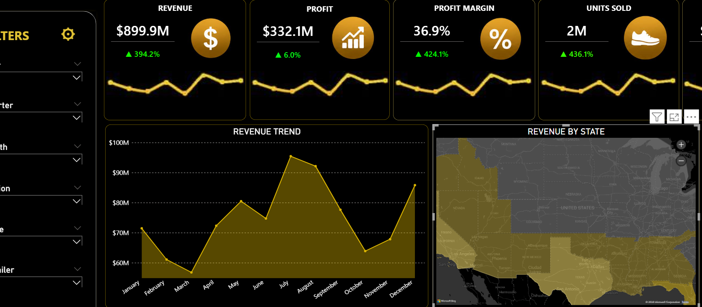
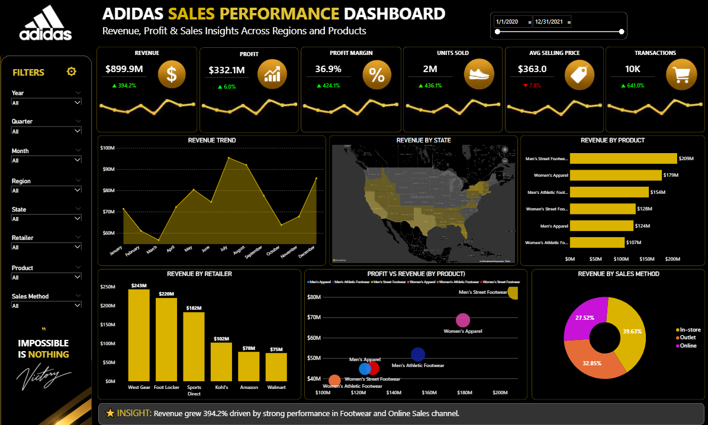

# ⚫🟡 Adidas Sales Performance Dashboard

## 📌 Project Overview
This Power BI dashboard was developed to analyze Adidas sales performance and transform raw sales data into actionable business insights. The dashboard provides an interactive view of revenue, profit, sales trends, product performance, and regional performance.

## 🎯 Business Objectives
- Monitor overall sales performance
- Track revenue and profitability
- Identify top-performing products
- Analyze regional sales trends
- Support data-driven decision making

## 📊 Key KPIs
- Total Revenue
- Total Profit
- Profit Margin
- Units Sold
- Sales by Region
- Product Performance

## 🛠️ Tools Used
- Power BI
- Microsoft Excel
- Data Cleaning & Transformation
- Data Visualization

## 📈 Key Insights
- Revenue and profit trends across regions
- Best-performing product categories
- Sales distribution by location
- Opportunities for business growth

## 📷 Dashboard Preview
## 📷 Dashboard Preview

### Dashboard Overview

### Sales Dashboard

## 👤 Author
Victory Ebhohimen

Aspiring Data Analyst passionate about transforming data into actionable insights.
